# Ministry of Education Digital Call Center System 🇸🇱

## Revolutionizing Public Service Delivery Through Cloud Technology

**Developed by School District Sierra Leone for the Ministry of Education**

---

## 📋 Executive Summary

This open-source, cloud-based call center system eliminates the need for expensive physical infrastructure while seamlessly integrating with local toll-free numbers. We've created a solution that reduces operational costs by up to 99% while dramatically improving service quality.

**The Challenge**: Traditional call centers require $50,000-$100,000+ in initial investment - costs that are prohibitive for many government ministries.

**Our Solution**: A fully cloud-based system costing less than $1,000/year, connects to existing toll-free numbers, deployable in days.

**The Impact**: The Ministry of Education can provide world-class call center services to citizens across Sierra Leone without building a single server room.

---

## 🌍 Background & Vision

### Our Story

School District Sierra Leone's centralized school management system is operational in multiple schools across Sierra Leone. Building on this success, we developed this open-source call center solution for the Ministry of Education, with plans to make it available to other government organizations.

### The Vision

A future where every government ministry and public organization in Sierra Leone can afford modern call center technology. Where:

- **Citizens** easily reach government through familiar phone numbers
- **Government staff** work remotely with powerful browser-based tools
- **Ministries** redirect saved costs toward program delivery  
- **Technology** enables rather than barriers better governance

### Why Open Source?

- **No Vendor Lock-In**: Organizations own technology and data completely
- **Continuous Improvement**: Global community contributions
- **Transparency**: Every line auditable for security
- **Sustainability**: Survives beyond any single company
- **Customization**: Adaptable to specific needs

---

## 🎯 The Problem We're Solving

### Traditional Call Center Costs

| Component | Traditional Cost | Our Solution |
|-----------|-----------------|--------------|
| Physical Servers | $15,000-$30,000 | $0 (Cloud) |
| PBX Hardware | $10,000-$50,000 | $0 (Software) |
| Server Room | $5,000-$15,000 | $0 (No physical infrastructure) |
| Network Infrastructure | $3,000-$10,000 | Included in cloud |
| Annual Maintenance | $10,000-$20,000/yr | $600/year |
| **Total Year 1** | **$65,000-$150,000+** | **<$1,000** |

### Challenges Solved

1. **Astronomical Infrastructure Costs** → 99% cost reduction
2. **Geographic Centralization** → Work from anywhere
3. **Rigid Scalability** → Add agents instantly
4. **Limited Functionality** → AI, analytics, automation included
5. **Integration Challenges** → Connects to local toll-free numbers

---

## ✨ Our Solution: Hybrid Cloud-Local Architecture

### The Innovation

```
┌─────────────────────────────────────────────┐
│         CLOUD LAYER (Management)            │
│  • Web Dashboard                            │
│  • Database & Storage                       │
│  • AI Engine                                │
│  • Analytics                                │
└───────────────────┬─────────────────────────┘
                    │ Secure Connection
┌───────────────────┴─────────────────────────┐
│    TELEPHONY LAYER (Local Network)          │
│  • Asterisk PBX                             │
│  • WebRTC Gateway                           │
│  • SIP Trunk to Telecom                     │
│  • Toll-Free Number (117)                   │
└───────────────────┬─────────────────────────┘
                    │ Phone Network
                    ↓
            [Citizens Call 117]
```

### Key Benefits

✅ **Cost-Effective**: 99% infrastructure cost reduction  
✅ **Scalable**: Add agents without hardware  
✅ **Accessible**: Work from anywhere  
✅ **Integrated**: Local toll-free + cloud management  
✅ **Modern**: AI, analytics, automation built-in  
✅ **Open-Source**: No vendor lock-in  
✅ **Reliable**: Cloud redundancy + local telephony  
✅ **Fast Deployment**: Days, not months  

---

## 🏗️ System Architecture

### High-Level Flow

```mermaid
graph TB
    A[👤 Citizen Calls 117] --> B[📡 Local Telecom]
    B --> C[☁️ Asterisk PBX]
    C --> D[🎵 IVR Menu]
    D --> E{Queue Selection}
    E --> F[🎧 Available Agent]
    F --> G[💻 WebRTC Browser Call]
    G --> H[📝 Case Created]
    H --> I[✅ Issue Resolved]
    I --> J[📊 Analytics Updated]
    
    K[🌐 Web Visitor] --> L[💬 AI Chatbot]
    L --> M[🤖 DeepSeek AI]
    M --> N[📚 FAQ Database]
    
    style A fill:#4CAF50
    style G fill:#2196F3
    style H fill:#FF9800
    style J fill:#9C27B0
```



### Technology Stack

#### Frontend
- **Next.js 13** - Modern React framework
- **TailwindCSS** - Beautiful, responsive UI
- **WebRTC** - Browser-based calling
- **shadcn/ui** - Component library

#### Backend  
- **NestJS** - Enterprise Node.js framework
- **PostgreSQL** - Reliable database
- **TypeORM** - Database management
- **JWT** - Secure authentication

#### Communication
- **Asterisk** - Open-source PBX
- **SIP Trunking** - Telecom connectivity
- **WebSockets** - Real-time updates
- **DeepSeek AI** - Intelligent chatbot

---

## 🔄 How It Works

### Complete Call Flow


### User Roles Flow


---

## 🌟 Key Features

### 📞 **Call Management**
- Real-time dashboard with live metrics
- Visual call flow builder (drag-and-drop)
- Intelligent IVR routing
- Automatic call recording
- WebRTC browser calling
- Queue management with position announcements

### 🎫 **Case/Ticket System**
- Automatic case creation on call connect
- Priority system (Critical → Low)
- Call recording linkage
- Reference numbers (CASE-2025-0001)
- Duration tracking
- Search and filter capabilities

### 👥 **HR & Staff Management**
- QR code generation for each staff
- Contactless check-in/check-out
- Automatic late detection
- Daily/monthly attendance reports
- Staff profiles and schedules
- Performance tracking

### 🤖 **AI Features**
- DeepSeek AI chatbot (24/7)
- Sentiment analysis during calls
- Predictive analytics
- Anonymous citizen chat
- Natural language understanding
- Context-aware responses

### 📊 **Analytics & Reporting**
- Real-time dashboard metrics
- Call duration and resolution rates
- Agent performance statistics
- Case resolution time tracking
- Custom date range reports
- Export to Excel/PDF

### 🔐 **Security & Access Control**
- 5 predefined roles (Admin, Supervisor, Agent, Analyst, Auditor)
- Granular permissions
- Audit logging
- Encrypted data storage
- JWT authentication
- Session management

### 🎨 **Content Management**
- Public landing page
- Blog posts and news
- FAQ system
- Downloadable resources
- Multi-language support
- SEO optimization

### 📱 **Mobile App** (Optional)
- Expo-based React Native app
- Citizen call initiation
- IVR option selection
- Real-time status updates
- Offline FAQ access
- Push notifications

---

## 📱 Offline Capabilities

### Internet Down Scenarios

#### Agent Internet Drops
- Current call continues (WebRTC buffering)
- Automatically marked offline
- Reconnects when internet returns
- Syncs missed events

#### Server Internet Drops
- Active calls continue (Asterisk local)
- Call recordings save locally
- New calls still route through IVR
- Dashboard updates pause
- Full sync when connection returns

#### Power Outage
- UPS provides 30-60 minutes backup
- Graceful shutdown if prolonged
- Automatic restart when power returns
- No data loss

### Progressive Web App (PWA)
- Works offline with cached data
- Instant loading (<1 second)
- Background synchronization
- Push notifications
- Install on home screen

---

## 📈 Scalability & Performance

### Current Capacity (Out-of-Box)
- **Concurrent Calls**: 50-100
- **Active Agents**: 20-50  
- **Database**: 1M cases, 10M call records
- **Storage**: 500GB recordings  
- **Response Time**: <2 seconds

### Scaling Options

#### Vertical Scaling
```
$50/month → 100 calls, 50 agents
$100/month → 200 calls, 100 agents
$200/month → 500 calls, 250 agents
```

#### Horizontal Scaling
```
Add servers as needed:
• Web Server: $30/month
• Database Server: $50/month
• Asterisk Server: $40/month
• Load Balancer: $20/month
```

### Performance Optimizations
- CDN for static assets
- Database query caching
- WebSocket connection pooling
- Automatic load balancing
- Geographic redundancy

---

## 🎯 Use Cases

### Ministry of Education (Primary)
- **Exam Malpractice Reports**: Citizens report cheating, receive case number
- **Teacher Complaints**: Document issues, track resolution
- **School Facility Problems**: Building damage, missing resources
- **General Inquiries**: Enrollment, policies, procedures

### Other Ministries (Adaptable)
- **Health**: Appointment scheduling, emergency hotline
- **Agriculture**: Pest reports, weather information
- **Social Welfare**: Benefit inquiries, complaint lodging
- **Finance**: Tax questions, payment status

### Private Sector (Commercial Use)
- **Banks**: Customer service, fraud reporting
- **Telecom**: Technical support, billing
- **Utilities**: Outage reports, service requests
- **Insurance**: Claims processing, policy information

---

## 💰 Total Cost of Ownership (5 Years)

### Traditional Setup
```
Year 1: $65,000 (hardware + setup)
Year 2-5: $20,000/year (maintenance)
Total: $145,000 over 5 years
```

### Our Cloud Solution
```
Year 1: $1,000 (hosting + setup)
Year 2-5: $600/year (hosting)
Total: $3,400 over 5 years

SAVINGS: $141,600 (97.7% reduction)
```

### What You Can Do With Savings
- Hire 100+ additional teachers
- Build 20+ new classrooms
- Buy 50,000+ textbooks
- Fund 500+ student scholarships
- **Deliver actual education services**

---

## 🚀 Deployment Timeline

### Week 1: Planning
- Requirements gathering
- Toll-free number setup
- Cloud account creation
- Team training schedule

### Week 2: Setup
- Deploy to cloud platform
- Configure Asterisk PBX
- Connect to telecom provider
- Load initial data

### Week 3: Configuration  
- Design IVR menus
- Create routing rules
- Set up user accounts
- Customize branding

### Week 4: Testing & Launch
- User acceptance testing
- Agent training
- Soft launch (limited hours)
- Full production launch

**Total: 4 weeks from start to full operation**

---

## 🤝 Support & Community

### Getting Help
- **Documentation**: Comprehensive guides included
- **GitHub Issues**: Report bugs, request features
- **Email Support**: support@education.gov.sl
- **Community Forum**: Connect with other users

### Contributing
We welcome contributions from:
- Developers (code improvements)
- Designers (UI/UX enhancements)
- Translators (additional languages)
- Testers (bug reports)
- Documenters (better guides)

### Roadmap
- **Q1 2025**: SMS integration
- **Q2 2025**: WhatsApp Business API
- **Q3 2025**: Advanced AI features
- **Q4 2025**: Multi-tenant support

---

## 📞 Contact

**School District Sierra Leone**  
Email: info@schooldistrict.sl  
Phone: +232 XX XXX XXXX  
Website: www.schooldistrict.sl

**Ministry of Education, Sierra Leone**  
Email: info@education.gov.sl  
Phone: Toll-Free 117  
Website: www.education.gov.sl

---

## 📝 License

MIT License - Free for commercial and non-commercial use

---

**Built with ❤️ for the people of Sierra Leone** 🇸🇱

*Empowering Government, Serving Citizens*
