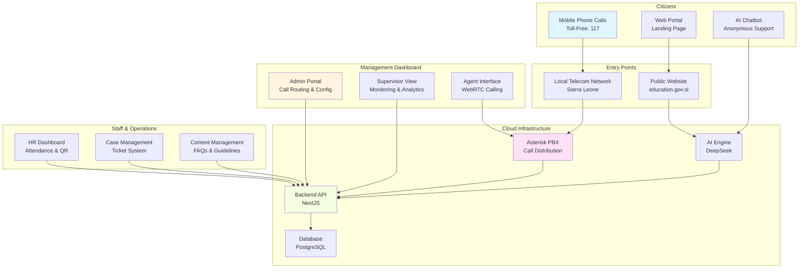
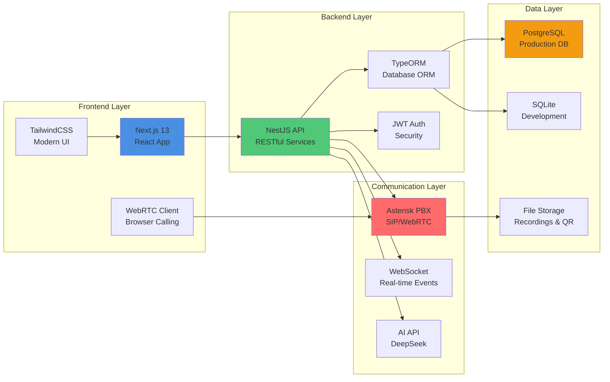
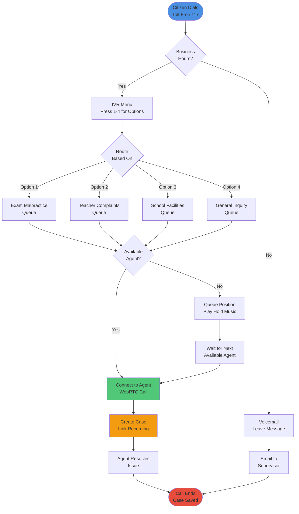
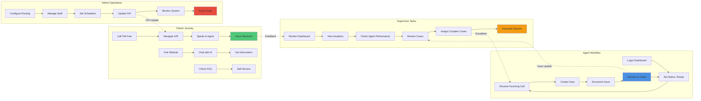

# Ministry of Education Digital Call Center System 🇸🇱

## Open-Source Cloud-Based Call Center Solution for Public Sector Organizations

**Built by School District Sierra Leone** | **Empowering the Ministry of Education**

A revolutionary, fully-digitalized call center infrastructure that eliminates the need for expensive physical server setups while seamlessly integrating with local toll-free numbers. This open-source solution enables government ministries and organizations to modernize their citizen engagement at a fraction of traditional costs.

---

## 📖 Table of Contents

- [About the Project](#about-the-project)
- [The Problem We Solve](#the-problem-we-solve)
- [Our Solution](#our-solution)
- [System Architecture](#system-architecture)
- [How It Works](#how-it-works)
- [Key Features](#key-features)
- [Technology Stack](#technology-stack)
- [Roles & Permissions](#roles--permissions)
- [Offline Capabilities](#offline-capabilities)
- [Scalability & Performance](#scalability--performance)
- [Use Cases](#use-cases)
- [Support](#support)

---

## 📋 About the Project

### Background

School District Sierra Leone has successfully deployed a centralized school management system currently operational in multiple schools across the country. Building on this success, we developed this open-source call center solution specifically for the Ministry of Education, with the vision of making it available to other government organizations and institutions.

### Vision

To democratize access to modern call center technology by providing a cloud-based, cost-effective alternative to traditional physical infrastructure, while maintaining the reliability and familiarity of local telephone systems.

### Mission

Enable government ministries and public sector organizations in Sierra Leone and beyond to:
  Nice
- **Improve Citizen Services** through faster response times and better call management
- **Digitalize Operations** completely, eliminating manual processes
- **Scale Effortlessly** as call volumes and staff grow
- **Maintain Accessibility** by integrating with existing toll-free numbers

---

## 🎯 The Problem We Solve

### Traditional Call Center Challenges

#### 1. **Prohibitive Infrastructure Costs**
Traditional call centers require:
- Physical server rooms with cooling and power backup
- Multiple servers for redundancy
- Network infrastructure and cabling
- Ongoing maintenance contracts

**For many ministries and organizations, these costs are simply unaffordable.**

#### 2. **Geographic Limitations**
- Agents must work from a central location
- Difficult to hire talent from across the country
- Single point of failure if office becomes inaccessible
- Limited disaster recovery options

#### 3. **Scalability Issues**
- Adding new agents requires hardware upgrades
- Seasonal call volume spikes overwhelm systems
- Expansion means purchasing more equipment
- Cannot easily test or pilot programs

#### 4. **Management Complexity**
- Manual attendance tracking prone to errors
- Difficult to monitor agent performance in real-time
- No centralized view of operations
- Limited analytics and reporting

#### 5. **Integration Challenges**
- Toll-free numbers isolated from digital systems
- Cannot leverage mobile or remote capabilities
- Poor integration with modern tools
- Limited citizen self-service options

---

## ✨ Our Solution

### A Hybrid Cloud-Local Architecture

Our system combines the best of both worlds:

#### **Cloud-Based Management** (Reduces Costs)
- All management interfaces run in the cloud
- No physical servers needed for administration
- Access from anywhere with internet
- Automatic updates and maintenance


#### **Local Telephony Integration** (Maintains Reliability)
- Direct connection to the ministry toll-free numbers
- Calls remain on local telecom networks
- No international routing costs
- Works with existing phone infrastructure
- Familiar experience for citizens

### How This Saves Money

### Key Benefits
 
✅ **Scalable**: Add agents without hardware purchases  
✅ **Accessible**: Work from anywhere with internet  
✅ **Integrated**: Connects local phones with digital tools  
✅ **Modern**: AI, analytics, and automation built-in  
✅ **Open-Source**: No vendor lock-in, full customization  
✅ **Reliable**: Cloud redundancy + local telephony  
✅ **Fast Deployment**: Operational in days, not months  

---

## 🏗️ System Architecture

### High-Level Overview



### Component Architecture



---

## 🔄 How It Works

### Call Flow Architecture



### User Role Flow



---

## 🌟 Key Features

### 📞 Call Management
- **Real-time Dashboard** - Monitor active calls, queue stats, and agent performance
- **Call Flow Builder** - Visual drag-and-drop interface (Twilio Studio-style)
- **Intelligent Routing** - Priority-based routing with IVR support
- **Call Recording** - Automatic recording with playback
- **WebRTC Integration** - Browser-based calling
- **Asterisk Integration** - Auto-generated dialplans

### 🎫 Case/Ticket Management
- **Priority System** - Critical, Urgent, High, Medium, Low
- **Call Linking** - Link voice recordings to cases
- **Auto Reference Numbers** - CASE-2025-0001 format
- **Duration Tracking** - Automatic resolution time calculation
- **Search & Filter** - Find cases by status, priority, category
- **Notes & Attachments** - Full case documentation

### 👥 Staff/HR Management
- **QR Code Generation** - Auto-generated on staff enrollment
- **QR Attendance Tracking** - Check-in/Check-out via QR scan
- **Late Detection** - Automatic status based on schedule
- **Attendance Reports** - Daily, weekly, monthly statistics
- **Staff Profiles** - Complete employee information
- **Work Schedules** - Customizable per staff member

### 🤖 AI Features
- **DeepSeek AI Integration** - Intelligent chatbot for citizens
- **Sentiment Analysis** - Real-time call emotion tracking
- **AI Analytics** - Call trends and insights
- **Anonymous Chat** - Privacy-focused citizen support

### 📊 Analytics & Reporting
- **Real-time Metrics** - Live dashboard with key KPIs
- **Call Analytics** - Duration, resolution rates, trends
- **Agent Performance** - Individual and team statistics
- **Case Statistics** - Resolution time, priority distribution
- **Attendance Reports** - Staff presence tracking

### 🔐 Role-Based Access Control (RBAC)
- **Admin** - Full system access
- **Supervisor** - Monitoring and oversight
- **Agent** - Simplified call handling interface
- **Analyst** - Analytics and reporting only
- **Auditor** - View-only compliance access

### 🎨 Content Management
- **Blog Posts** - Public information portal
- **FAQ System** - Self-service knowledge base
- **Guidelines** - Dos & Don'ts for citizens
- **Landing Page** - Ministry-branded public portal

---

## 🛠️ Technology Stack

### Backend
- **Framework**: NestJS
- **Database**: TypeORM + SQLite/PostgreSQL
- **Authentication**: JWT
- **QR Codes**: qrcode library
- **AI**: DeepSeek API
- **PBX**: Asterisk AMI

### Frontend
- **Framework**: Next.js 13 (App Router)
- **UI**: React + TailwindCSS
- **Components**: shadcn/ui
- **Auth**: NextAuth.js
- **Animation**: Framer Motion
- **Charts**: Recharts
- **Flow Builder**: React Flow
- **Icons**: Lucide React

### DevOps
- **Version Control**: Git
- **Package Manager**: npm
- **Environment**: Node.js
- **Deployment**: Docker (optional)

## 📚 Documentation

- [Complete System Summary](./COMPLETE_SYSTEM_SUMMARY.md)
- [RBAC & Routing Guide](./RBAC_AND_REAL_ROUTING_GUIDE.md)
- [Call Flow Builder Guide](./CALL_FLOW_BUILDER_GUIDE.md)
- [Call System Guide](./CALL_SYSTEM_GUIDE.md)

## 🔧 Development

### Backend Development
```bash
cd backend
npm run start:dev     # Start in watch mode
npm run build         # Build for production
npm run test          # Run tests
```

### Frontend Development
```bash
cd frontend
npm run dev           # Start dev server
npm run build         # Build for production
npm run lint          # Run linter
```

### Database Migrations
```bash
cd backend
npm run typeorm migration:generate -- -n MigrationName
npm run typeorm migration:run
```

## 🚢 Deployment

### Production Build
```bash
# Backend
cd backend
npm run build
npm run start:prod

# Frontend
cd frontend
npm run build
npm run start
```

### Environment Variables (Production)
- Set `NODE_ENV=production`
- Use PostgreSQL instead of SQLite
- Set strong `NEXTAUTH_SECRET`
- Configure proper `ASTERISK_DIALPLAN_PATH`
- Add production `DEEPSEEK_API_KEY`

## 🤝 Contributing

1. Fork the repository
2. Create feature branch (`git checkout -b feature/AmazingFeature`)
3. Commit changes (`git commit -m 'Add AmazingFeature'`)
4. Push to branch (`git push origin feature/AmazingFeature`)
5. Open Pull Request

## 📝 License

This project is licensed under the MIT License.

## 👏 Acknowledgments

- Ministry of Education, Sierra Leone
- DeepSeek AI for intelligent chatbot
- Asterisk PBX community
- Next.js and NestJS teams

## 📞 Support

For issues and questions:
- Create an issue on GitHub
- Email: support@education.gov.sl

---

**Built with ❤️ for the Ministry of Education, Sierra Leone** 🇸🇱
